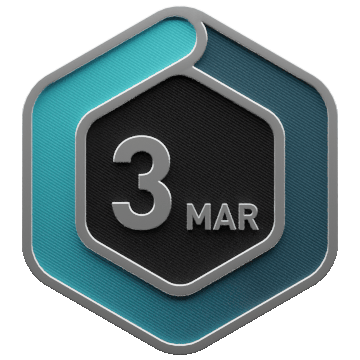

<div align="center">


  ```ascii
╔═════════════════════════════════════════════════════════════════════════════╗
║   ██████╗ ██████╗ ██╗██╗   ██╗ █████╗ ███╗   ██╗███████╗██╗  ██╗██╗   ██╗   ║
║   ██╔══██╗██╔══██╗██║╚██╗ ██╔╝██╔══██╗████╗  ██║██╔════╝██║  ██║██║   ██║   ║
║   ██████╔╝██████╔╝██║ ╚████╔╝ ███████║██╔██╗ ██║███████╗███████║██║   ██║   ║
║   ██╔═══╝ ██╔══██╗██║  ╚██╔╝  ██╔══██║██║╚██╗██║╚════██║██╔══██║██║   ██║   ║
║   ██║     ██║  ██║██║   ██║   ██║  ██║██║ ╚████║███████║██║  ██║╚██████╔╝   ║
║   ╚═╝     ╚═╝  ╚═╝╚═╝   ╚═╝   ╚═╝  ╚═╝╚═╝  ╚═══╝╚══════╝╚═╝  ╚═╝ ╚═════╝    ║
╠═════════════════════════════════════════════════════════════════════════════╣
║           Dev     DSA        Systems        Neovim          AI              ║
╚═════════════════════════════════════════════════════════════════════════════╝
```


<picture>
  <source
    media="(prefers-color-scheme: dark)"
    srcset="https://raw.githubusercontent.com/priyanshuf11/priyanshuf11/github-breakout/images/breakout-dark.svg"
  />
  <source
    media="(prefers-color-scheme: light)"
    srcset="https://raw.githubusercontent.com/priyanshuf11/priyanshuf11/github-breakout/images/breakout-light.svg"
  />
  
</picture>
</div>
<div align="left">


## 🚀 Tech Stack

| Category | Technologies |
|----------|-------------|
| Languages |      |
| Frameworks |       |
| Databases |    |
| APIs |   |
| Tools |          |
| UI / State |    |
| Exploring |     |

<h2>About Me</h2>

  ```json
priyanshu@terminal:~$ cat /etc/profile.d/bio.conf

{
  "user": {
    "name": "Priyanshu Farkonde",
    "designation": "Systems Architect & ML Researcher",
    "affiliation": "YCCE, Nagpur",
    "location": "India [GMT+5:30]"
  },
  "core_competencies": {
    "01_development": "Full-Stack Systems & Architecture Design",
    "02_logic": "Algorithmic Optimization & Data Structures",
    "03_scripting_ml": "Automated Workflows & Unsupervised Learning"
  },
  "philosophy": "A bug for a bug makes the whole system legacy."
}

priyanshu@terminal:~$
```
</div>
<div >
  <h2>LeetCode</h2>

  <!-- STATS -->
  <p>
    
  </p>

  <!-- BADGES -->
  <h3>Badges:</h3>
  <p align="center">
    
    
    
    
  </p>
</div>
